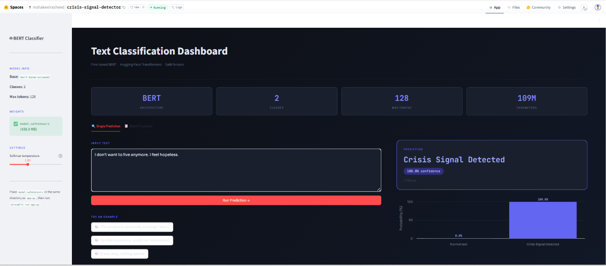
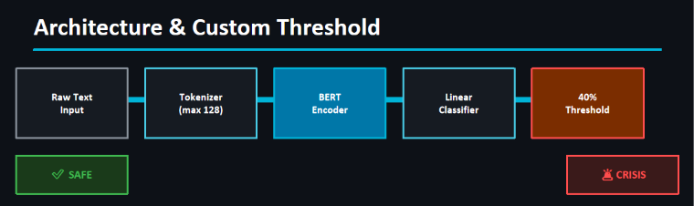

<div align="center">

# 🧠 Crisis Signal Detector

### Real-Time Mental Health Crisis Detection using Fine-Tuned BERT

An AI-powered Natural Language Processing (NLP) application that detects crisis-related text using a fine-tuned **BERT (Bidirectional Encoder Representations from Transformers)** model and provides real-time predictions through an interactive **Streamlit** dashboard deployed on **Hugging Face Spaces**.

<p>


</p>

### 🚀 Live Demo

**🚀 Live Demo:** [Try the Crisis Signal Detector](https://huggingface.co/spaces/mshakeelrasheed/crisis-signal-detector)

</div>

---

# 📑 Table of Contents

- Overview
- Problem Statement
- Features
- Dashboard Preview
- System Architecture
- Model Workflow
- Dataset
- Methodology
- Technology Stack
- Repository Structure
- Installation
- Usage
- Project Documentation
- Results
- Challenges Faced
- Model Weights
- Future Improvements
- Author
- License

---

# 📖 Overview

**Crisis Signal Detector** is a Natural Language Processing (NLP) application that identifies whether an input text contains a potential crisis signal.

The project leverages a **fine-tuned BERT model** from Hugging Face Transformers for binary text classification and provides predictions through an intuitive **Streamlit** web interface.

This project was developed as the **final capstone project** during the **NAVTTC-sponsored Artificial Intelligence & Machine Learning Training Program** conducted at **Corvit Systems Bahawalpur**.

The primary objective of this project is to demonstrate how transformer-based NLP models can assist in the early detection of crisis-related text, providing a foundation for intelligent mental health support systems.

---

# 🎯 Problem Statement

Mental health issues have become an increasing global concern, and identifying crisis-related language at an early stage can help support timely intervention.

The objective of this project is to build an AI-powered system capable of classifying textual input into one of two categories:

- **Crisis Signal**
- **Normal Text**

using a fine-tuned **BERT** model trained for binary text classification.

---

# ✨ Features

- 🔹 Real-time crisis text detection
- 🔹 Fine-tuned BERT model
- 🔹 Binary text classification
- 🔹 Confidence score prediction
- 🔹 Interactive Streamlit interface
- 🔹 Hugging Face deployment
- 🔹 Docker support
- 🔹 Clean and responsive dashboard
- 🔹 Fast inference using Transformer architecture

---

# 📸 Dashboard Preview

<p align="center">

</p>

---

# 🏗️ System Architecture

<p align="center">

</p>

---

# 🧠 Model Workflow

```text
User Input
      │
      ▼
Text Preprocessing
      │
      ▼
BERT Tokenizer
      │
      ▼
Fine-Tuned BERT Model
      │
      ▼
Softmax Layer
      │
      ▼
Binary Classification
      │
      ▼
Prediction + Confidence Score
```

---

# 📊 Dataset

The dataset used for this project was obtained from **Kaggle**.

**Dataset Link**

**Dataset:** [Suicide Watch Dataset (Kaggle)](https://www.kaggle.com/datasets/nikhileswarkomati/suicide-watch/data)

### Dataset Details

- **Source:** Kaggle
- **Task:** Binary Text Classification
- **Original Dataset Size:** 130,000+ text samples
- **Classes:**
  - Crisis Signal
  - Normal Text

### Training Dataset

Although the original dataset contains over **130,000 samples**, the model was fine-tuned using a subset of **10,000 samples**.

This decision was made because the project was developed on hardware with limited computational resources during the NAVTTC training program. Using a carefully selected subset allowed efficient training while still producing reliable predictions for the prototype application.

---

# 🔬 Methodology

The project followed the complete Machine Learning and Deep Learning pipeline:

1. Dataset Collection
2. Data Cleaning
3. Exploratory Data Analysis (EDA)
4. Text Preprocessing
5. Tokenization using the BERT Tokenizer
6. Fine-tuning the pre-trained BERT model
7. Model Evaluation
8. Deployment using Streamlit on Hugging Face Spaces

The trained model predicts whether an input sentence represents a crisis signal and displays the prediction together with a confidence score.

# 🛠 Technology Stack

| Category | Technologies |
|-----------|--------------|
| Programming Language | Python |
| Deep Learning Framework | PyTorch |
| Natural Language Processing | Hugging Face Transformers |
| Pre-trained Model | BERT |
| Data Processing | Pandas, NumPy |
| Data Visualization | Matplotlib, Seaborn |
| Web Framework | Streamlit |
| Deployment | Hugging Face Spaces |
| Containerization | Docker |
| Version Control | Git & GitHub |

---

# 📂 Repository Structure

```text
crisis-signal-detector/
│
├── app.py
├── requirements.txt
├── Dockerfile
├── README.md
├── LICENSE
│
├── model/
│   ├── config.json
│   ├── tokenizer.json
│   ├── tokenizer_config.json
│   └── (model.safetensors not included)
│
├── notebook/
│   └── training.ipynb
│
├── presentation/
│   └── CrisisSignalDetector.pdf
│
└── screenshots/
    ├── dashboard.png
    └── architecture.png
```

> **Note:** The trained model weights (`model.safetensors`) are not included in this repository because they exceed GitHub's file size limit. The complete application is deployed and available on Hugging Face Spaces.

---

# ⚙️ Installation

### Clone the repository

```bash
git clone https://github.com/mshakeelrasheed/crisis-signal-detector.git
```

### Navigate to the project directory

```bash
cd crisis-signal-detector
```

### Install dependencies

```bash
pip install -r requirements.txt
```

### Run the application

```bash
streamlit run app.py
```

---

# 🚀 Usage

1. Launch the Streamlit application.
2. Enter any text into the input field.
3. Click **Run Prediction**.
4. The application will display:
   - Predicted Class (Crisis / Normal)
   - Confidence Score
   - Probability Visualization

---

# 📄 Project Documentation

This repository contains:

- ✅ Source Code
- ✅ Training Notebook
- ✅ Project Presentation
- ✅ Model Configuration Files
- ✅ Docker Configuration
- ✅ Dashboard Screenshots
- ✅ System Architecture
- ✅ Deployment Resources

---

# 📊 Results

The fine-tuned BERT model successfully performs binary text classification to identify crisis-related language.

### Output Includes

- ✅ Crisis / Normal Classification
- ✅ Confidence Score
- ✅ Probability Visualization
- ✅ Real-time Prediction

The application has been successfully deployed on **Hugging Face Spaces**, allowing users to test the model through an interactive web interface.

---

# ⚠️ Challenges Faced

During the development of this project, several technical challenges were encountered:

- Working with a transformer-based BERT model on limited hardware resources.
- Training on a subset of the original dataset to reduce computational requirements.
- Managing the large size of the trained model during deployment.
- GitHub's file size limitation prevented uploading the `model.safetensors` file.
- Configuring and deploying the application successfully on Hugging Face Spaces.
- Organizing the repository to provide clear documentation while keeping it lightweight.

These challenges were addressed through dataset optimization, efficient deployment practices, and proper project organization.

---

# ⚠️ Model Weights

The trained model weights (`model.safetensors`) are **not included** in this repository because they exceed GitHub's maximum file size limit.

To explore the complete application, please use the deployed version on **Hugging Face Spaces**.

---

# 🔮 Future Improvements

Future enhancements planned for this project include:

- 🌍 Multi-language crisis detection
- 🤖 Support for additional transformer models
- 📱 Mobile application integration
- ☁️ REST API using FastAPI
- 🧠 Explainable AI (XAI) for prediction interpretation
- 📊 Training on the complete dataset using high-performance hardware
- 🔄 Continuous model retraining with updated datasets
- 📈 Performance monitoring and model versioning

---

# 👨‍💻 Author

## Muhammad Shakeel Rasheed

**BS Artificial Intelligence**

**Islamia University Bahawalpur**

Passionate about Artificial Intelligence, Machine Learning, Deep Learning, Natural Language Processing, and AI Automation.

### Connect with me

- **GitHub:** https://github.com/mshakeelrasheed
- **LinkedIn:** https://www.linkedin.com/in/muhammad-shakeel-rasheed

---

# 📜 License

This project is licensed under the **MIT License**.

Feel free to use, modify, and distribute this project in accordance with the license terms.

---

<div align="center">

## ⭐ If you found this project useful, consider giving it a Star!

Thank you for visiting this repository.

</div>
